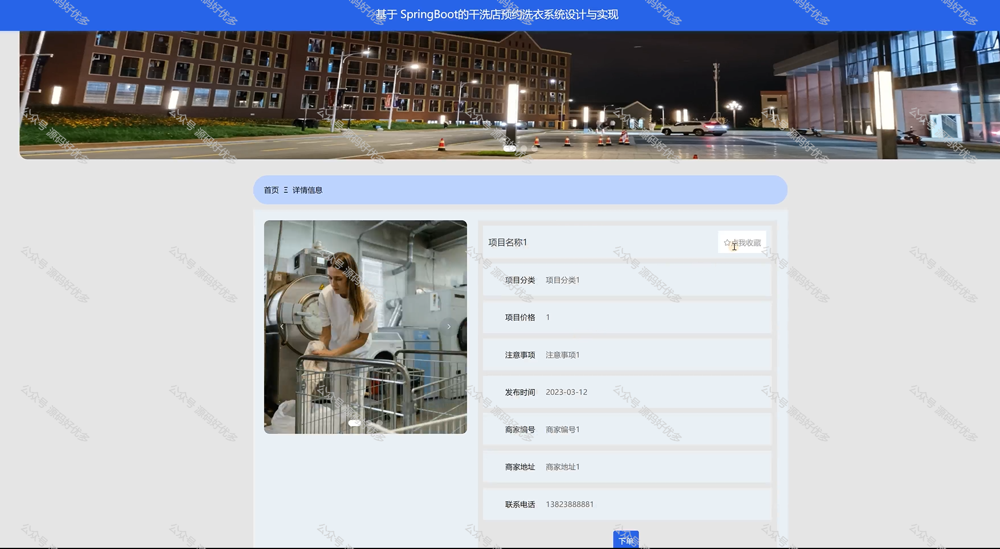
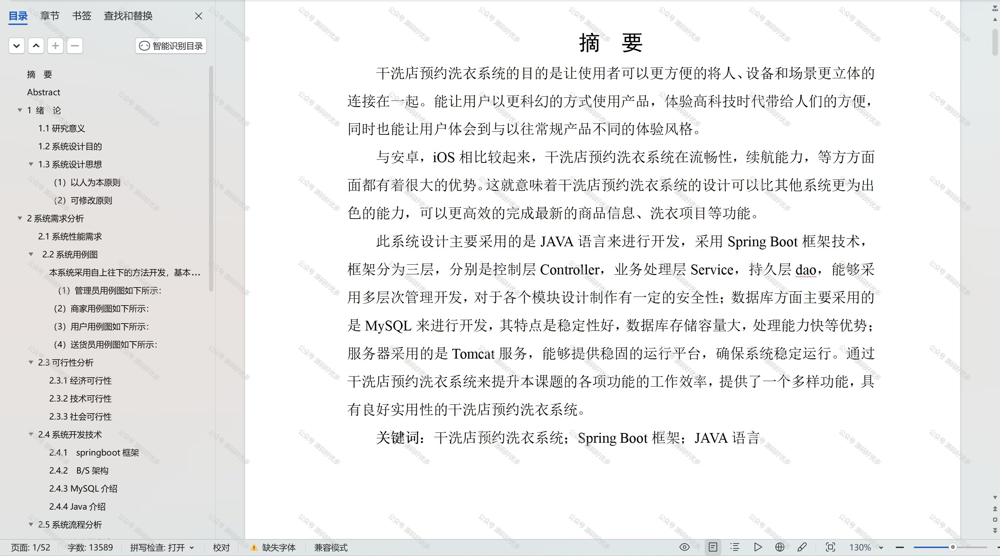

 
## 查看主页获取源码

### 一、作品包含

源码+数据库+设计文档万字+PPT+全套环境和工具资源+部署教程

### 二、项目技术

前端技术：Html、Css、Js、Vue、Element-ui

数据库：MySQL

后端技术：Java、Spring Boot、MyBatis

  

### 三、运行环境

开发工具：IDEA/eclipse

数据库：MySQL5.7

数据库管理工具：Navicat10以上版本

环境配置软件： JDK1.8+Maven3.6.3

前端Nodejs：14

### 四、项目介绍
项目编号：springbootA197

干洗店预约洗衣系统是在快节奏的现代生活中，为了满足人们对便捷、高效洗衣服务的需求而设计的信息化解决方案。随着工作压力的增大和生活节奏的加快，越来越多的消费者倾向于选择能够节省时间和精力的洗衣服务，实现了顾客与干洗店之间的无缝对接，提升了服务效率，优化了顾客体验，同时也为干洗店带来了更精细化的运营管理和潜在的业务增长。

前台用户功能：浏览首页、商品信息、洗衣项目、公告信息、后台管理、在线客服、购物车和个人中心。

后台分为管理员、用户、商家、送货员
管理员的功能：系统首页、个人中心、商家管理、用户管理、送货员管理、项目分类管理、商品分类管理、商品信息管理、洗衣项目管理、订单信息管理、接单记录管理、配送订单管理、配送进度管理、评价记录管理、系统管理、订单管理。
用户的功能：系统首页、个人中心、订单信息管理、接单记录管理、配送订单管理、配送进度管理和评价记录管理。
商家的功能：系统首页、个人中心、项目分类管理、洗衣项目管理、订单信息管理、接单记录管理、配送订单管理、配送进度管理、评价记录管理。
送货员的功能：系统首页、个人中心、配送订单管理、配送进度管理和评价记录管理。

### 五、运行截图

  

